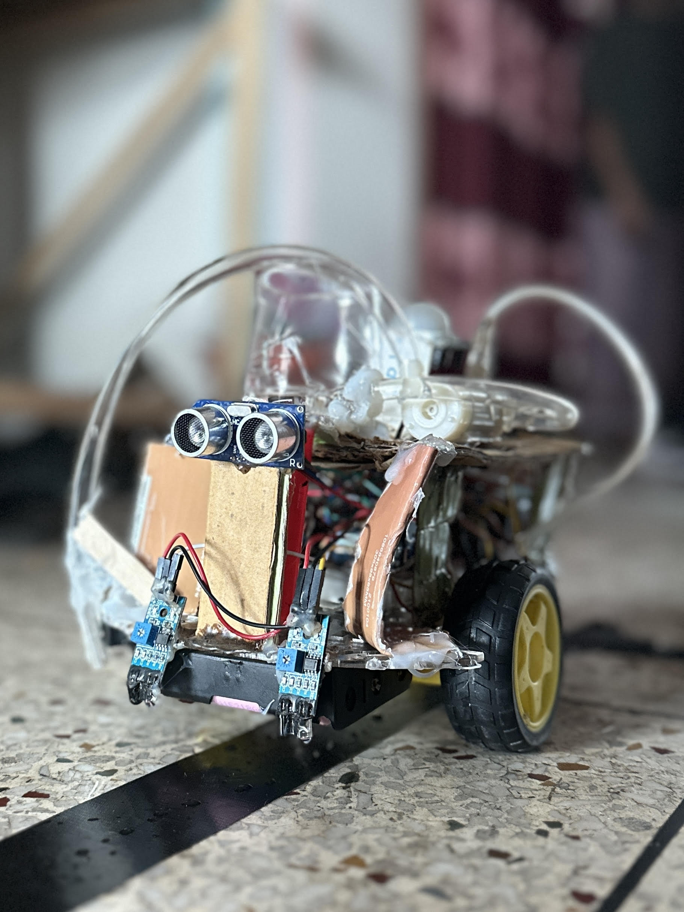

# Line-Following-Cleaner-Robot
A smart line following, vaccum cleaner, water spary and moping robot with object and motion detection feature
<h2>This is a group project</h2>
<h2>Other Group Members :</h2> 

1. <button><a href = "https://github.com/tu-Rahat">Md. Toslim Uddin Rahat</button>
  

2. <button><a href = "https://github.com/ARSahil">Ashique Rahman Sahil</button>

<h1>LFCR</h1>

<h1>Components Used</h1>
<h3>1. Arduino Uno R3</h3>
<h3>2. Breadboard Half Size Bare 400 Tie Points</h3>
<h3>3. Jumper Wires 20 pcs 20 cm</h3>
<h3>4. 2WD Wheel Drive Mobile Robot Platform Chassis</h3>
<h3>5. IR Obstacle Sensor</h3>
<h3>6. LED Red</h3>
<h3>7. Sonar Sensor HC SR04</h3>
<h3>8. L298N Motor Driver</h3>
<h3>9. DC 6V Micro Pump Motor</h3>
<h3>10. Pipe for Pump Motor</h3>
<h3>11. PIR Motion Sensor Module</h3>
<h3>12. 14500 Rechargeable Lithium Battery 1200mah 3.7v</h3>
<h3>13. Servo Motor MG996R</h3>
<h3>14. 3S 10A 18650 Lithium Battery Charging Board, BMS Protection Module 12.6V</h3>
<h3>15. ATmega328P-PU PDIP-28 Microcontroller</h3>
<h3>16. Battery Holder</h3>
<h3>17. XL7015 5V-80V DC-DC 0.8A Dc Converter Step-down Module Wide Voltage Input LM2596</h3>

<h1>Circuit Diagram</h1>

<h1>Functionality 1</h1>
    <h2>Overview</h2>
    <h3>Follows a black line to travel</h3>
    <h2>Working Procedure</h2>
    <h3>
        Two IR Sensors are used to detect the black line by sensing the reflected infrared ray. 
        Black surfaces absorb more light, resulting in low sensor reading. If both sensors detect 
        the line, the robot moves forward. If the left sensor detects the line, the robot moves left. 
        If the right sensor detects the line, the robot moves right. BO motors are controlled by motor 
        driver pins (IN1, IN2, ENA, IN3, IN4, ENB). HIGH and LOW signals are sent to the motor driver 
        to move the motors accordingly.
    </h3>
    <h1>Functionality 2</h1>
    <h2>Overview</h2>
    <h3>Vacuums, Sprays water and Mops the line as it moves</h3>
    <h2>Working Procedure</h2>
    <h3>
        Two pump motors (one for vacuum and one for spraying water), and the brush servo are controlled 
        by motor driver pins (VACUUM_RUN, WATER_RUN, VACUUM_WATER_ENA). The brush servo motor moves from 
        0 to 180 degrees to mimic the sweeping movement. When the sensors detect black line, the vacuum, 
        water pump and brush activates by enableWaterVacuumBrush() function. If the robot stops after 
        motion or object detection, the components deactivate by disableWaterVacuumBrush() function.
    </h3>
    <h1>Functionality 3</h1>
    <h2>Overview</h2>
    <h3>Detects obstacles and humans</h3>
    <h2>Working Procedure</h2>
    <h3>
        Sonar sensor (TRIG_PIN and ECHO_PIN) emits ultrasonic waves to measure the distance between robot 
        and obstacles. If the object is within threshold distance (<=20 cm), the robot stops along with the 
        vacuum, water pump and brush and turns on the LED light (MOTION_LED). The PIR Sensor (MOTION_SENSOR) 
        detects human motion by sensing infrared radiation changes. If the PIR sensor detects motion, the 
        robot stops as well and turns on the LED light. Once the obstacle is removed or motion stops, the 
        robot starts to move again after a debounce time (MOTION_CLEAR_TIME or clearDuration).
    </h3>
